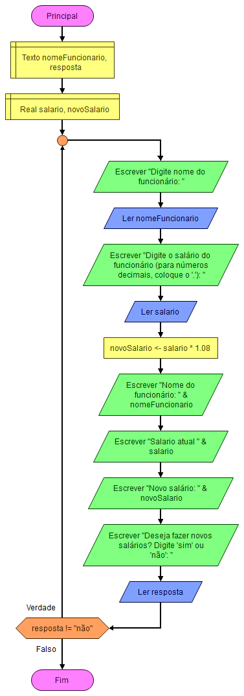

```MD
Algoritmo "exercicio02-repetição"

var
  nome: caractere
  salario, novo_salario: real
  resposta: caractere

inicio
repita
    escreva("Digite o nome do funcionário: ")
    leia(nome)
    escreva("Digite o salário do funcionário: ")
    leia(salario)
    
    novo_salario := salario * 1.08

    escreval("Nome: ", nome)
    escreval("Salário atual: R$", salario:6:2)
    escreval("Novo salário: R$", novo_salario:6:2)

    escreva("Deseja fazer novos cálculos? (Sim/Não): ")
    leia(resposta)

ate resposta = "Não"

fimalgoritmo
```

# Fluxograma


