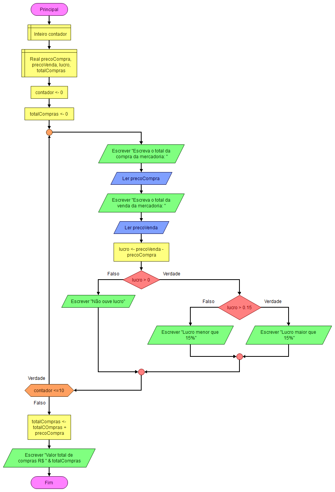

# Código
```MD
Algoritmo "exercicio03-repetição"

var
  preco_compra, preco_venda, lucro, total_compras: real
  i: inteiro

inicio
total_compras := 0

para i de 1 ate 10 faca
    escreva("Digite o preço de compra da mercadoria ", i, ": ")
    leia(preco_compra)
    escreva("Digite o preço de venda da mercadoria ", i, ": ")
    leia(preco_venda)

    lucro := preco_venda - preco_compra

    se lucro > 0 entao
      se lucro > 0.15 * preco_compra entao
        escreval("Lucro maior que 15%")
      senao
        escreval("Lucro menor ou igual a 15%")
      fimse
    senao
      escreval("Não houve lucro")
    fimse
    total_compras := total_compras + preco_compra
fimpara

escreval("Valor total das compras: R$", total_compras:6:2)

fimalgoritmo
```

# Fluxograma
