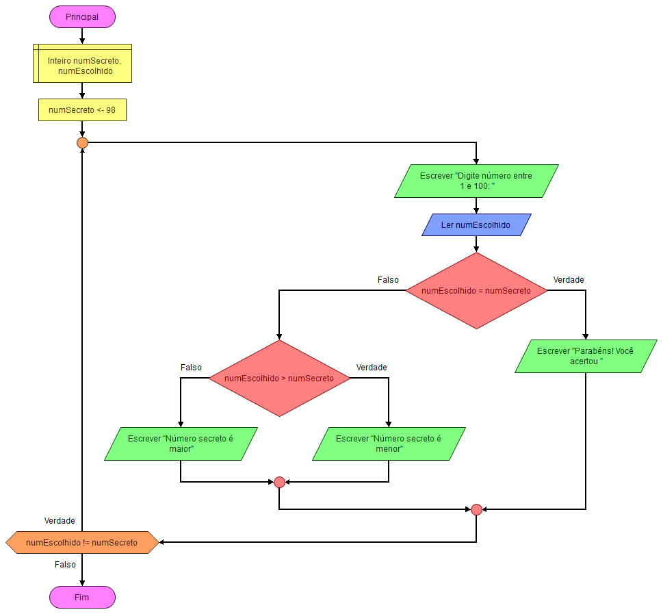

# Código
```md
algoritmo "exercicio4-repeticao"
var
    numero_secreto: inteiro
    palpite: inteiro
inicio
repita
        numero_secreto := aleatorio(1, 100)
        repita
            escreva("Digite um número entre 1 e 100: ")
            leia(palpite)

            se palpite < numero_secreto entao
                escreval("O número é maior, tente novamente")
            senao
                se palpite > numero_secreto entao
                    escreval("O número é menor, tente novamente")
                fimse
            fimse

        ate palpite = numero_secreto
        escreval("Parabéns! Você acertou!")
ate falso
fimalgoritmo

```
# Fluxograma
