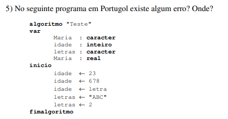

# Erros encontrados 

1. Declaração de variável duplicada: O código possui duas declarações variáveis de mesmo nome __Maria__;
2. A atribuição do valor da variável __idade__, que é do tipo _inteiro_, é feita atribuindo uma outra variável chamada __letra__, mas essa não foi declarada. Pode-se ter a tentativa de atribuir o texto _letra_ dentro da variável, o que também é um erro, pois a variável __idade__ só recebe número;
3. A variável __letra__ recebe o valor = 2, porém, a variável foi declarada para receber dados textuais, utilizando o tipo _caracter_.